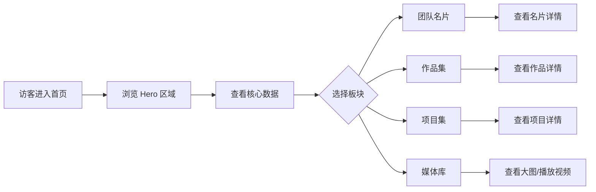
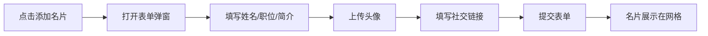

# Dream of Youth 团队展示网站 — 产品需求文档

## 1. 产品概述

Dream of Youth 是一个面向年轻创意团队的在线展示平台，用于展示团队成员名片、作品集、项目集、照片和视频内容。网站以"青春、梦想、创意"为核心气质，打造一个令人印象深刻的团队形象展示窗口。

目标用户：潜在客户、合作伙伴、招聘方以及对团队感兴趣的访客。

## 2. 核心功能

### 2.1 用户角色

| 角色 | 说明 | 核心权限 |
|------|------|----------|
| 访客 | 无需注册 | 浏览所有公开内容 |
| 管理员 | 后台管理 | 添加/编辑/删除名片、作品、项目、媒体内容 |

### 2.2 功能模块

1. **首页**：团队品牌展示、核心数据、最新动态、快速导航
2. **团队名片页**：团队成员名片展示，支持添加新名片
3. **作品集页**：创意作品分类展示
4. **项目集页**：团队项目案例展示
5. **媒体库页**：照片和视频展示
6. **关于我们页**：团队介绍、联系方式

### 2.3 页面详情

| 页面名称 | 模块名称 | 功能描述 |
|----------|----------|----------|
| 首页 | Hero 区域 | 全屏动态背景，团队口号，滚动引导 |
| 首页 | 数据统计 | 成员数、作品数、项目数等核心数据动画展示 |
| 首页 | 精选内容 | 最新作品、热门项目卡片轮播 |
| 首页 | 快速导航 | 各板块入口卡片 |
| 团队名片页 | 名片网格 | 成员名片网格布局，头像、姓名、职位、简介 |
| 团队名片页 | 添加名片 | 表单弹窗，填写姓名、职位、头像、简介、社交链接 |
| 团队名片页 | 名片详情 | 点击名片展开详情，展示完整信息 |
| 作品集页 | 作品画廊 | 瀑布流/网格布局，分类筛选 |
| 作品集页 | 作品详情 | 大图展示、作品描述、创作时间 |
| 项目集页 | 项目列表 | 项目卡片，包含封面、标题、简介、技术栈标签 |
| 项目集页 | 项目详情 | 详细描述、项目截图、参与成员 |
| 媒体库页 | 照片墙 | 照片网格，支持点击查看大图 |
| 媒体库页 | 视频区 | 视频卡片，支持播放 |
| 关于我们页 | 团队介绍 | 团队愿景、使命、价值观 |
| 关于我们页 | 联系方式 | 邮箱、社交链接、联系表单 |

## 3. 核心流程

### 3.1 访客浏览流程

访客进入首页 → 浏览 Hero 区域 → 查看数据统计 → 点击导航进入各板块 → 浏览名片/作品/项目/媒体 → 查看详情

### 3.2 添加名片流程

管理员点击"添加名片" → 填写表单 → 上传头像 → 提交 → 名片展示在网格中

## 4. 用户界面设计

### 4.1 设计风格

**整体风格：现代极简 + 青春活力**

- **主色调**：
  - 背景色：#0A0A0F（深邃夜空黑）
  - 主色：#6366F1（靛蓝紫，代表梦想）
  - 辅助色：#EC4899（粉红，代表青春）
  - 强调色：#F59E0B（琥珀金，代表活力）
  - 文字色：#F8FAFC（主文字）、#94A3B8（次要文字）

- **按钮风格**：
  - 主按钮：渐变背景（靛蓝紫到粉红），圆角 12px，悬浮时发光效果
  - 次按钮：透明背景 + 边框，悬浮时填充

- **字体选择**：
  - 标题字体："Noto Sans SC"（中文）+ "Space Grotesk"（英文数字）
  - 正文字体："Noto Sans SC"
  - 标题字号：Hero 64px、页面标题 48px、卡片标题 24px
  - 正文字号：16px，行高 1.6

- **布局风格**：
  - 单页应用（SPA）风格，顶部固定导航
  - 内容区域最大宽度 1280px，居中
  - 大量留白，模块间距 80-120px
  - 卡片圆角 16px，阴影层次

- **图标风格**：Lucide React 图标库，线性风格，1.5px 描边

### 4.2 动效设计

- **页面加载**：渐进式加载，元素依次淡入（stagger 100ms）
- **滚动动画**：元素进入视口时触发淡入上浮动画
- **Hover 效果**：卡片悬浮时轻微上浮（translateY -8px）+ 阴影增强
- **数据动画**：数字统计使用计数动画，从 0 滚动到目标值
- **背景效果**：Hero 区域使用动态渐变网格（gradient mesh）+ 粒子效果

### 4.3 页面设计概览

| 页面名称 | 模块名称 | UI 元素 |
|----------|----------|---------|
| 首页 | Hero 区域 | 全屏渐变背景、动态粒子、团队口号、滚动指示器 |
| 首页 | 数据统计 | 4 个数据卡片，大数字 + 标签，图标装饰 |
| 首页 | 精选内容 | 横向滚动卡片，作品/项目封面 + 标题 |
| 首页 | 快速导航 | 4 个入口卡片，图标 + 标题 + 描述 |
| 团队名片页 | 名片网格 | 响应式网格，头像圆形裁剪，信息卡片 |
| 团队名片页 | 添加按钮 | 右下角固定悬浮按钮，渐变背景 |
| 作品集页 | 作品画廊 | 瀑布流布局，分类标签筛选栏 |
| 项目集页 | 项目列表 | 卡片网格，封面图 + 标题 + 标签 |
| 媒体库页 | 照片墙 | 网格布局，等比例缩略图 |
| 媒体库页 | 视频区 | 视频卡片，播放按钮覆盖 |
| 关于我们页 | 团队介绍 | 大段文字 + 装饰性引号 |
| 关于我们页 | 联系方式 | 联系表单 + 社交图标链接 |

### 4.4 响应式设计

- **桌面端优先**（1280px+）：完整布局，所有功能
- **平板端**（768px-1279px）：网格列数减少，导航收起为汉堡菜单
- **移动端**（<768px）：单列布局，底部固定导航，触摸优化

## 5. 内容管理

### 5.1 名片数据结构

| 字段 | 类型 | 说明 |
|------|------|------|
| id | string | 唯一标识 |
| name | string | 姓名 |
| role | string | 职位/角色 |
| avatar | string | 头像图片 URL |
| bio | string | 个人简介 |
| skills | string[] | 技能标签 |
| social | object | 社交链接（GitHub、微博、邮箱等） |
| joinDate | string | 加入时间 |

### 5.2 作品数据结构

| 字段 | 类型 | 说明 |
|------|------|------|
| id | string | 唯一标识 |
| title | string | 作品标题 |
| category | string | 分类（设计/摄影/视频/其他） |
| cover | string | 封面图片 URL |
| images | string[] | 作品图片集 |
| description | string | 作品描述 |
| author | string | 创作者 |
| date | string | 创作日期 |

### 5.3 项目数据结构

| 字段 | 类型 | 说明 |
|------|------|------|
| id | string | 唯一标识 |
| title | string | 项目名称 |
| cover | string | 项目封面 URL |
| description | string | 项目简介 |
| techStack | string[] | 技术栈标签 |
| members | string[] | 参与成员 |
| link | string | 项目链接 |
| date | string | 项目时间 |

### 5.4 媒体数据结构

| 字段 | 类型 | 说明 |
|------|------|------|
| id | string | 唯一标识 |
| type | string | 类型（photo/video） |
| url | string | 媒体文件 URL |
| thumbnail | string | 缩略图 URL |
| title | string | 标题 |
| date | string | 拍摄/制作日期 |
