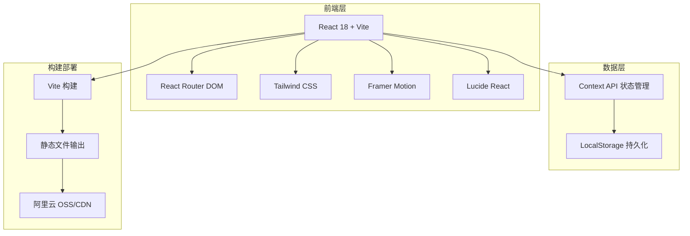
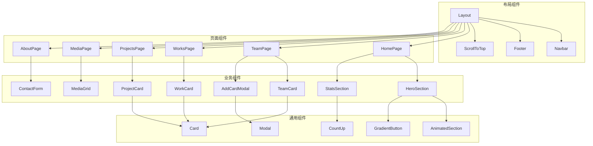
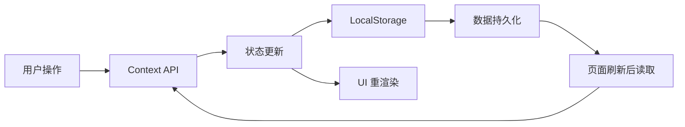

# Dream of Youth 团队展示网站 — 技术架构文档

## 1. 架构设计



## 2. 技术选型

| 技术 | 版本 | 用途 |
|------|------|------|
| React | 18.x | UI 框架 |
| Vite | 5.x | 构建工具 |
| Tailwind CSS | 3.x | 样式框架 |
| Framer Motion | 11.x | 动画库 |
| Lucide React | 0.x | 图标库 |
| React Router DOM | 6.x | 路由管理 |

**无后端架构说明**：
- 使用 LocalStorage 进行数据持久化，支持添加名片、作品、项目、媒体内容
- 所有数据存储在浏览器本地，刷新页面数据不丢失
- 适合静态部署到阿里云 OSS/CDN
- 如需后续扩展后端，可平滑迁移

## 3. 路由定义

| 路由 | 页面 | 说明 |
|------|------|------|
| / | 首页 | 团队品牌展示、数据统计、快速导航 |
| /team | 团队名片 | 成员名片展示、添加名片 |
| /works | 作品集 | 作品分类展示 |
| /projects | 项目集 | 项目案例展示 |
| /media | 媒体库 | 照片和视频展示 |
| /about | 关于我们 | 团队介绍、联系方式 |

## 4. 组件架构



## 5. 数据流设计



## 6. 项目目录结构

```
dream-of-youth/
├── public/
│   └── images/           # 静态图片资源
├── src/
│   ├── components/       # 通用组件
│   │   ├── Layout.jsx
│   │   ├── Navbar.jsx
│   │   ├── Footer.jsx
│   │   ├── AnimatedSection.jsx
│   │   ├── GradientButton.jsx
│   │   ├── Card.jsx
│   │   ├── Modal.jsx
│   │   └── CountUp.jsx
│   ├── pages/            # 页面组件
│   │   ├── HomePage.jsx
│   │   ├── TeamPage.jsx
│   │   ├── WorksPage.jsx
│   │   ├── ProjectsPage.jsx
│   │   ├── MediaPage.jsx
│   │   └── AboutPage.jsx
│   ├── sections/         # 页面区块组件
│   │   ├── HeroSection.jsx
│   │   ├── StatsSection.jsx
│   │   ├── FeaturedSection.jsx
│   │   └── QuickNavSection.jsx
│   ├── context/          # 状态管理
│   │   └── AppContext.jsx
│   ├── hooks/            # 自定义 Hooks
│   │   ├── useLocalStorage.js
│   │   └── useScrollAnimation.js
│   ├── data/             # 初始数据
│   │   └── initialData.js
│   ├── App.jsx
│   ├── main.jsx
│   └── index.css
├── index.html
├── vite.config.js
├── tailwind.config.js
├── postcss.config.js
└── package.json
```

## 7. 关键实现要点

### 7.1 动画实现
- 使用 Framer Motion 实现页面过渡和元素动画
- 滚动触发动画使用 `whileInView` 属性
- 数字计数动画使用自定义 Hook 实现

### 7.2 响应式设计
- Tailwind CSS 断点：sm(640px)、md(768px)、lg(1024px)、xl(1280px)
- 移动端优先的类名编写方式
- 导航栏在 md 以下切换为汉堡菜单

### 7.3 数据持久化
- 使用 LocalStorage 存储所有用户数据
- 提供初始示例数据
- 数据操作通过 Context API 统一管理

### 7.4 性能优化
- 图片懒加载
- 组件按需渲染
- CSS 动画优先，减少 JS 动画
- 构建时开启代码分割

## 8. 部署方案

### 8.1 阿里云部署步骤
1. 执行 `npm run build` 生成 dist 目录
2. 将 dist 目录内容上传至阿里云 OSS Bucket
3. 配置 OSS Bucket 为静态网站托管
4. 绑定自定义域名
5. 配置 CDN 加速（可选）

### 8.2 构建输出
- 纯静态文件（HTML、CSS、JS、图片）
- 无需服务器环境
- 支持任何静态托管服务
